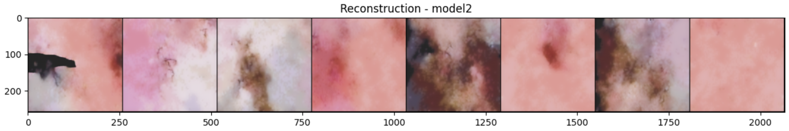

# Objective

- Train a Vector-Quantized Variational Autoencoder (VQ-VAE): To efficiently encode and decode high-dimensional image data while capturing meaningful latent representations of skin lesions.

- Develop an Auto-Regressive Model (Gated PixelCNN): To generate new, realistic images based on the learned latent space representations from the VQ-VAE.

## Dataset

- The ISIC dataset includes thousands of high-quality, dermoscopic images of various skin lesions, categorized by diagnosis, making it a valuable resource for research and educational purposes in medical imaging.

- Dataset Samples

  
  <em></em>

- The dataset can be downloaded from [here](https://www.kaggle.com/datasets/phatkararnav/assignment-4/data).

## Results
Following are some results. 

  
  <em></em>

  
  <em></em>

